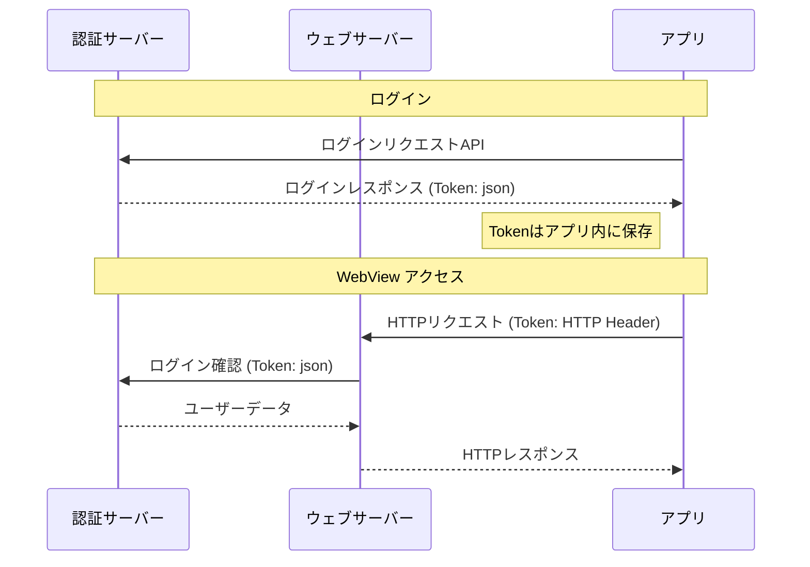

# シーケンス図のチートシート

```mermaid

sequenceDiagram
participant A as 認証サーバー
participant B as ウェブサーバー
participant C as アプリ
Note over A, C: ログイン
C->>A: ログインリクエストAPI
A-->>C: ログインレスポンス (Token: json)
Note left of C: Tokenはアプリ内に保存

Note over A, C: WebView アクセス
C->>B: HTTPリクエスト (Token: HTTP Header)
B->>A: ログイン確認 (Token: json)
A-->>B: ユーザーデータ
B-->>C: HTTPレスポンス
```
